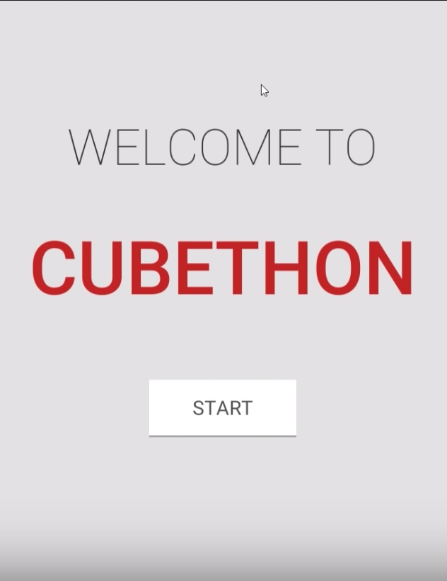
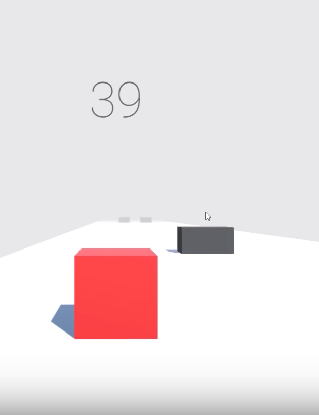
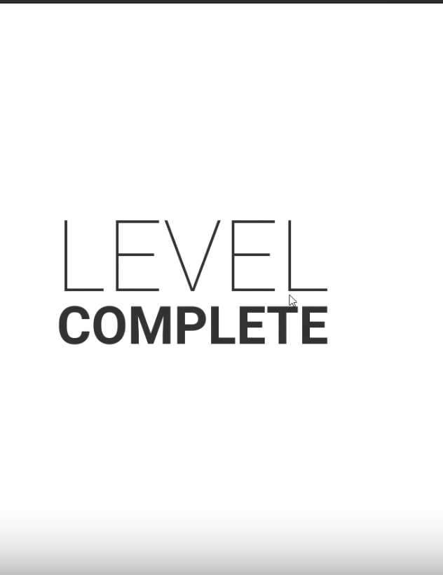

# cubethon_game
This is cube running game designed with Unity and C#. Uses need to control the direction of where the cube is running by click 'a' or 'd' in the keyboard to avoid all the obstacles. The score is control by how long the cube is running. The gravity effect is added to the cube go give gamers more realistic feelings.

